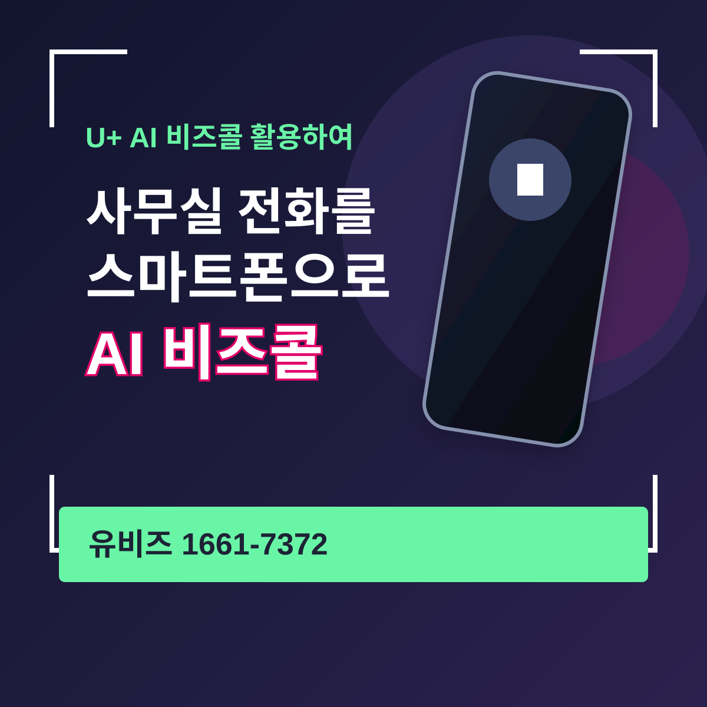
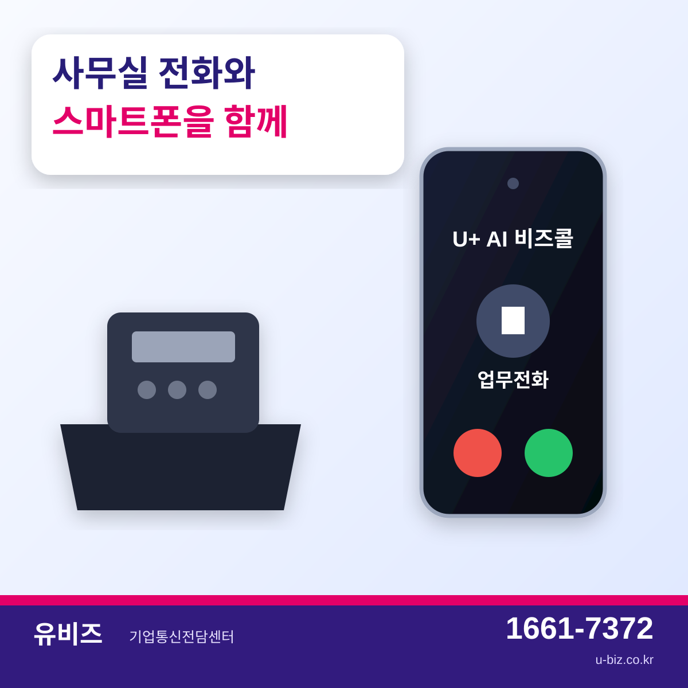
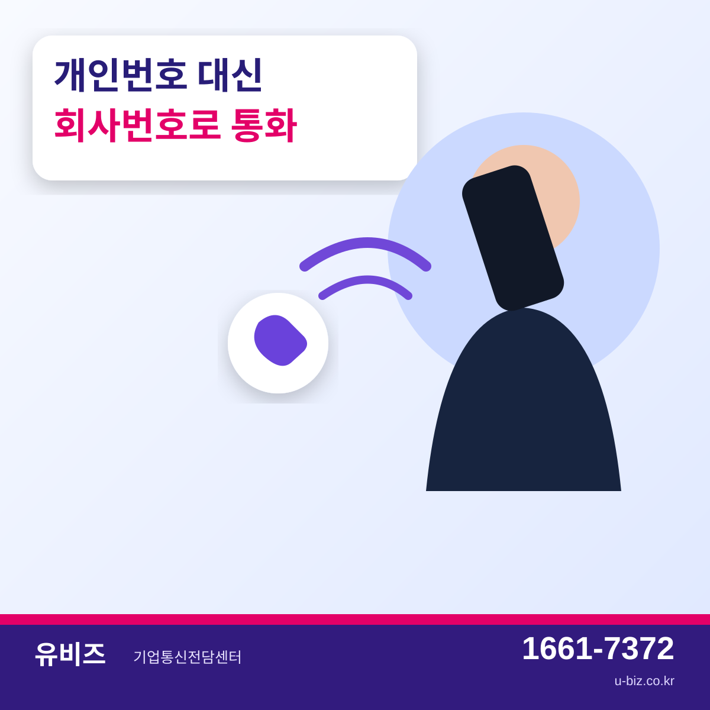
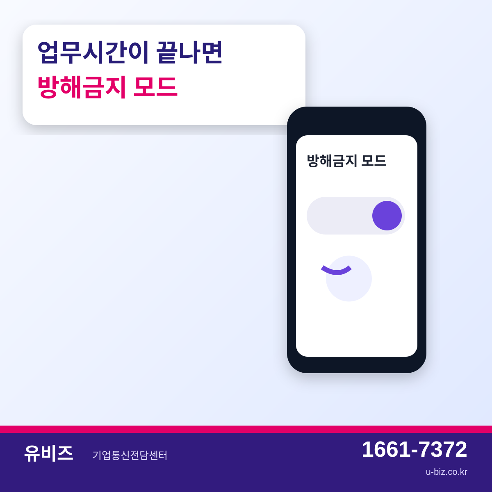
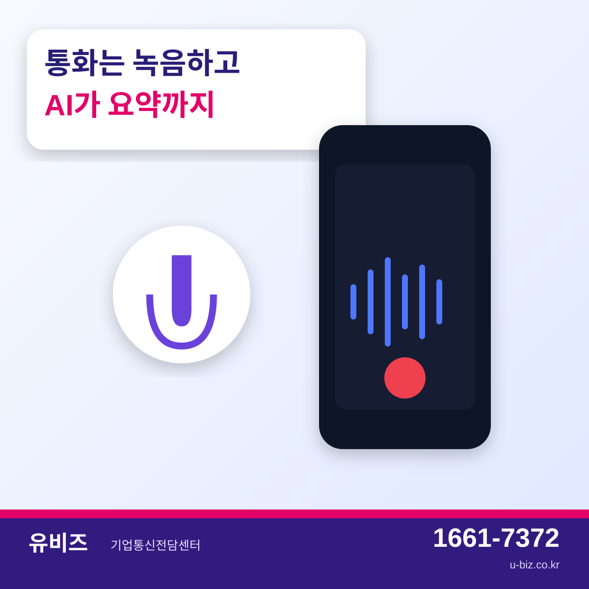
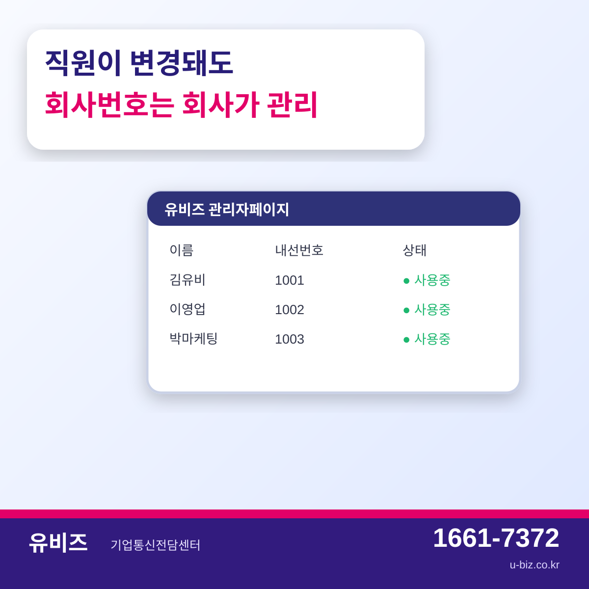
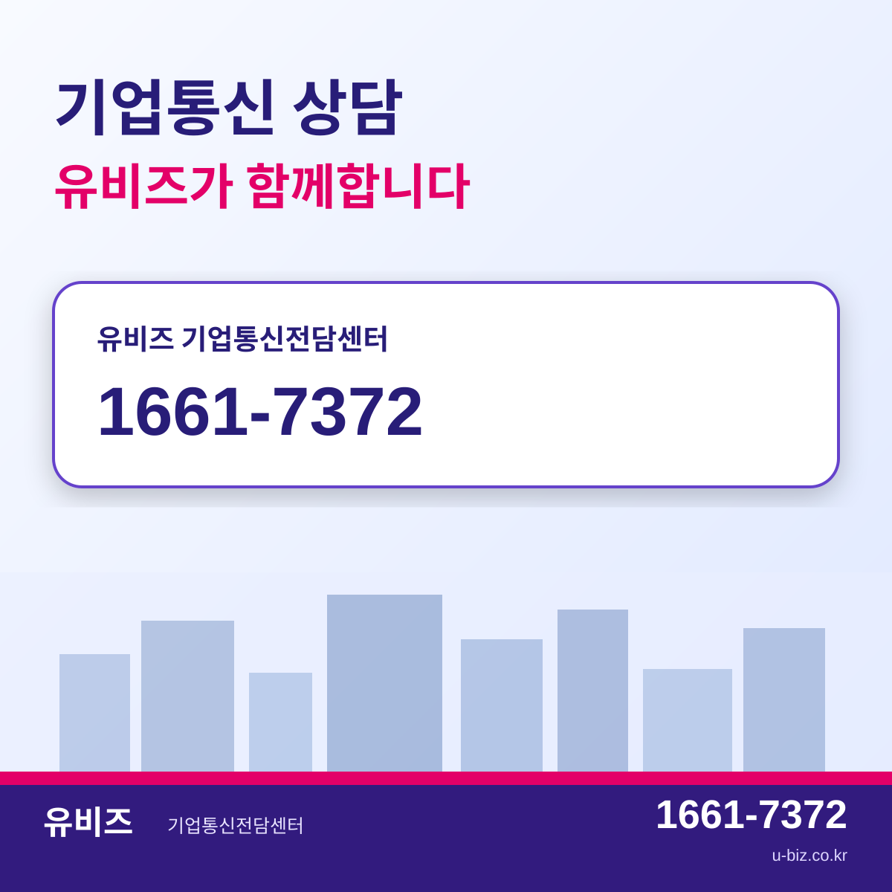

# 사무실 전화를 스마트폰으로, U+ AI 비즈콜 주요 기능 알아보기

외근이나 현장 업무가 많은 회사라면 사무실로 걸려오는 전화를 제때 받지 못해 아쉬웠던 경험이 있을 수 있습니다.  
고객은 회사 대표번호나 담당자의 업무번호로 연락했는데 담당자는 이동 중이고, 다시 연락하려면 개인 휴대폰 번호를 안내해야 하는 상황도 생깁니다.

**U+ AI 비즈콜은 기업전화를 스마트폰 앱과 연결해 회사번호를 보다 유연하게 사용할 수 있도록 돕는 기업용 전화 서비스입니다.**

사무실 전화 환경은 유지하면서, 직원은 스마트폰 앱을 통해 업무전화를 이용할 수 있어 외근·출장·현장 업무가 많은 기업에서 활용하기 좋습니다.

---

## 개인 휴대폰에서도 회사번호로 업무전화

업무용 연락을 개인 휴대폰으로 처리하다 보면 개인번호가 고객에게 노출되는 경우가 있습니다.

AI 비즈콜을 이용하면 스마트폰에 전용 앱을 설치해 **회사에서 사용하는 기업전화 번호를 업무용으로 활용**할 수 있습니다.

직원이 이동 중이거나 사무실 밖에 있을 때도 회사번호 기반으로 전화를 이용할 수 있어, 개인번호와 업무번호를 구분해 관리하려는 기업에 유용합니다.

휴대폰 통신사는 LG U+가 아니어도 앱을 이용할 수 있으며, 안드로이드와 iOS 환경을 지원합니다.

---

## 사무실 전화와 스마트폰을 함께 활용

고객이 회사번호로 전화했을 때 사무실 유선전화와 AI 비즈콜 앱이 설치된 스마트폰에서 함께 전화가 울리도록 구성할 수 있습니다.

영업 담당자가 외근 중이거나 현장 담당자가 자리를 비웠더라도 스마트폰을 통해 업무전화를 확인할 수 있기 때문에, 사무실 전화기에만 의존하던 환경보다 대응 범위를 넓힐 수 있습니다.

특히 다음과 같은 업무 환경에서 활용도를 기대할 수 있습니다.

- 외근과 방문 일정이 많은 영업조직
- 사무실과 현장을 자주 오가는 기업
- 고객 전화 응대가 중요한 중소기업
- 개인 휴대폰 번호 노출을 줄이고 싶은 조직
- 직원별 업무번호를 회사 차원에서 관리하고 싶은 기업

---

## 업무시간 이후에는 방해금지 모드

업무용 전화를 스마트폰에서 받는다고 해서 항상 전화를 받아야 하는 것은 아닙니다.

AI 비즈콜 앱에서는 **방해금지 모드 ON/OFF**를 사용할 수 있어, 업무가 끝난 뒤에는 필요에 따라 수신을 조절할 수 있습니다.

업무전화는 회사번호로 사용하면서 개인시간에는 수신을 끌 수 있기 때문에, 하나의 스마트폰에서도 개인용과 업무용 전화 사용을 구분하는 데 도움이 됩니다.

---

## 통화녹음과 AI 기반 업무지원

AI 비즈콜은 단순히 회사전화를 스마트폰으로 연결하는 기능뿐 아니라 업무지원 기능도 제공합니다.

앱을 통한 **통화녹음**을 지원하며, 아이폰에서도 AI 비즈콜 앱으로 통화하는 경우 녹취 기능을 사용할 수 있습니다.

또한 최근 AI 비즈콜에는 통화 자동요약, 다음 할 일 확인, 회의녹음·회의록 등 AI 기반 기능이 추가되어 통화 후 내용을 다시 정리하거나 업무사항을 확인하는 데 활용할 수 있습니다.

고객과 통화가 많은 영업팀이나 상담업무가 많은 조직이라면 통화내용을 정리하고 후속 업무를 챙기는 과정에서 활용할 수 있는 기능입니다.

---

## 직원 변경 시에도 회사가 번호를 관리

회사전화는 직원 개인의 번호가 아니라 기업의 업무자산으로 관리하는 것이 중요합니다.

AI 비즈콜은 기업관리자가 관리자페이지를 통해 직원 정보를 등록하고 회사번호를 배정하는 방식으로 운영됩니다.

담당자가 바뀌거나 직원이 변경되는 경우에도 관리자페이지에서 실사용자 정보를 수정해 업무번호를 계속 관리할 수 있습니다.

따라서 개인 휴대폰 번호 중심으로 고객관계를 관리하는 방식보다 직원 변경에 따른 업무전화 관리가 수월해질 수 있습니다.

---

## 회사 통화요금으로 처리되는 앱 발신

AI 비즈콜 앱을 통해 발신한 통화는 개인 휴대폰의 음성통화 요금이 아니라 **회사 통화요금으로 합산**되는 구조입니다.

다만 앱 사용에는 스마트폰 데이터가 사용되므로 직원의 휴대폰 데이터 이용환경은 함께 확인하는 것이 좋습니다.

---

## 우리 회사에 맞는 전화 구성이 중요합니다

AI 비즈콜은 현재 사용 중인 기업전화 방식과 회선 수, 직원 수, 단말 구성 등에 따라 실제 가입 구성이 달라질 수 있습니다.

단순히 앱만 설치하는 것보다 현재 회사에서 사용 중인 인터넷과 기업전화 환경을 먼저 확인하고, 필요한 회선 수와 업무방식을 기준으로 구성하는 것이 중요합니다.

유비즈에서는 기업의 기존 통신환경과 업무방식을 확인한 뒤 **기업인터넷, 기업전화, AI 비즈콜을 함께 검토해 적합한 구성을 안내**해드립니다.

---

**유비즈 기업통신전담센터**  
**1661-7372**  
**u-biz.co.kr**

#유비즈 #AI비즈콜 #비즈콜 #기업전화 #기업070 #인터넷전화 #사무실전화 #기업통신 #스마트오피스 #업무용전화
